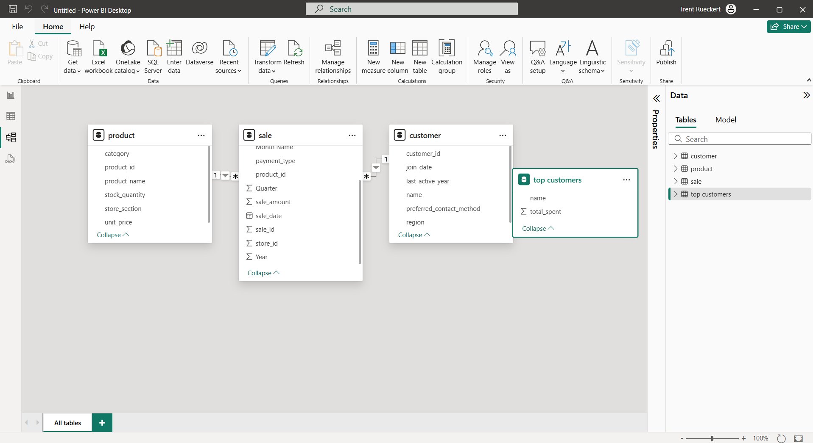
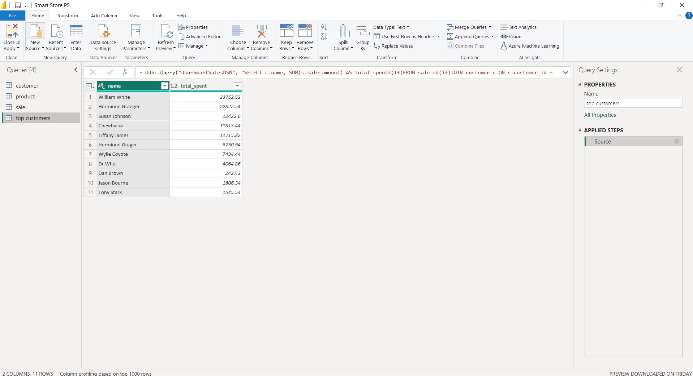
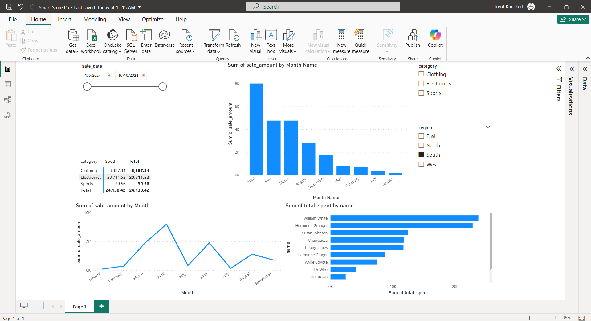
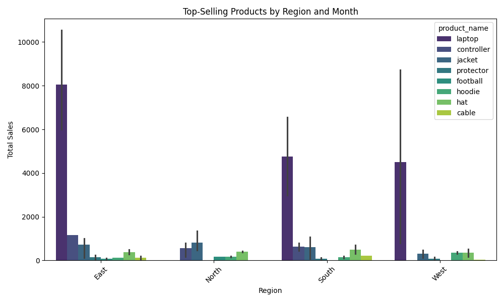
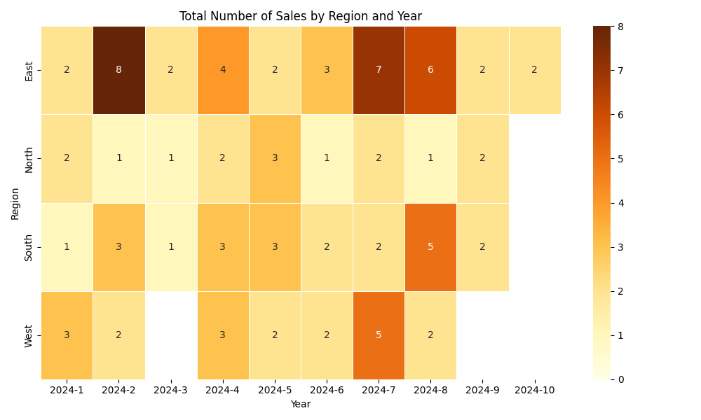
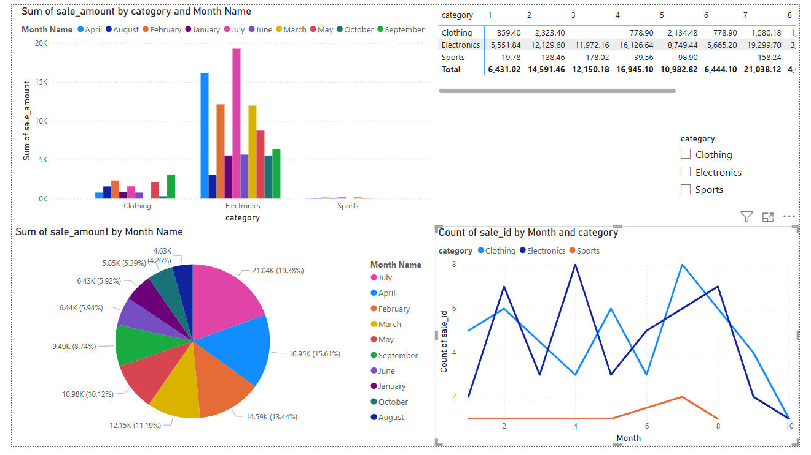

# smart-sales-starter-files

Starter files to initialize the smart sales project.

-----

## Project Setup Guide (Windows)

Run all commands from a PowerShell terminal in the root project folder.

### Step 2A - Create a Local Project Virtual Environment

```shell
py -m venv .venv
```

### Step 2B - Activate the Virtual Environment

```shell
.venv\Scripts\activate
```

### Step 2C - Install Packages

```shell
py -m pip install --upgrade -r requirements.txt
```

### Step 2D - Optional: Verify .venv Setup

```shell
py -m datafun_venv_checker.venv_checker
```

### Step 2E - Run the initial project script

```shell
py scripts/data_prep.py
```

-----

## Initial Package List

- pip
- loguru
- ipykernel
- jupyterlab
- numpy
- pandas
- matplotlib
- seaborn
- plotly
- pyspark==4.0.0.dev1
- pyspark[sql]
- git+https://github.com/denisecase/datafun-venv-checker.git#egg=datafun_venv_checker

-----

## Project 3

### Add Additional Data
1. Add additional columns:
   1. Customers - LastActiveYear, PreferredContactMethod
   2. Products - StockQuantity, StoreSection
   3. Sales - DiscountPercent, PaymentType
2. Load new data to the original raw file

### Clean and Prepare the Data
1. Create data prep scripts
   1. Create a subfolder 'data_preparation' in 'scripts'
   2. Create files in this subfolder for each raw file
2. Store the files in 'prepared' with new custom names
   1. 'customers_data_prepared.csv'
   2. 'products_data_prepared.csv'
   3. 'sales_data_prepared.csv'

```
py scripts/data_preparation/prepare_customers_data.py
py scripts/data_preparation/prepare_products_data.py
py scripts/data_preparation/prepare_sales_data.py
```

### Create Basic Data Scrubber
- The data is clean, but this will be more useful later
1. Create 'data_scrubber.py' in the 'scripts' folder
2. Create 'tests' folder with 'test_data_scrubber.py'
3. Run 'test_data_scrubber.py' to ensure it works

```
py tests/test_data_scrubber.py
```

-----

## Project 4

### Design Data Warehouse
- Choose the best schema design for the warehouse (we use star schema for this project)
- Plan out the schema to show the structure of the database

### Create the Data Warehouse
- In the scripts folder, create the file etl_to_dw.py
- Optional: Create a separate SQL file to verify/test the create_table statements
- In the etl_to_dw.py file, copy and paste the code from the example repo and make the adjustments needed for the specific added columns from the prepared data

### Run the Script to Create the Warehouse
- The command for Windows:

```
py scripts/etl_to_dw.py
```

-----

## Project 5
1. Describe your SQL queries and reports:
   1. We use various charts and graphs to show trends in our datasets with the SQL queries and reports detailed from our instructions
   2. Slicer for sale date range
   3. A matrix for total sale amount by category and region
   4. A clustered column chart for total sale amount by year, quarter, month
   5. A line chart for sales trends
   6. A bar chart for Top Customers
   7. A slicer for category
   8. A slicer for region
2. Explain dashboard design choices:
   1. I tried to keep the slicers towards the outside and the visualizations more to the middle
3. Include screenshot of Power BI Model View / Spark SQL Schema: 
4. Include screenshot of Query results: 
5. Include screenshot of Final Dashboard / Charts: 

-----

## Project 6
### Section 1: The Business Goal
* The business goal here is to analyze the sales trends by region and year/month to see which products sell the best, and to decide whether to increase or decrease the number of each product based on the results. If products are not selling in certain regions or certain times of the year, the business could do further analysis on why to see if it is worth it to keep supplying the same amount of products, and vice versa for if they are selling well.

### Section 2: Data Source
* I used olap_cubing.py to generate an OLAP cube from sales data stored in my SQLite database (smart_sales.db).
* From the sale table, I used: Year and Month (extracted from sale_date), sale_amount_sum (changed to total_sales), and sale_id_count.
* From the product table, I used: product_name.
* From the customer table. I used: region.

### Section 3: Tools
* I used some of the framework from (https://github.com/denisecase/smart-sales-olap/blob/main/scripts/olap_cubing.py) for my olap_cubing.py file.
* I used some of the framework from (https://github.com/denisecase/smart-sales-olap/blob/main/scripts/olap_goal_top_product_by_day.py) as well to get going on my olap_goal files.
* ChatGPT was utilized a bit to iron out any kinks in the olap_goal files.

### Section 4: Workflow & Logic
#### Dimensions
* The dimensions I used were Year, Month, region, and product_name.

#### Aggregations
* For total sales, I used the sum of sales and grouped it by Year, Month, region, and product_name.
* For the number of sales, I used the count of sales_id and grouped it by the the same as above. 

#### Logic
* To calculate the top products by month and region, I grouped the total sales by month and region and took a head of the top 3 products per month per region. The bar chart depicts these well.
* To calculate the top product volumn by region, I took the same approach but also grouped month and year together to showed a drilled-down heatmap, as well as a bar chart. 

### Section 5-6: Results and Suggested Business Action
* The results of the top products by total sales show not extremely surprising results, with laptops leading in 3 of 4 regions. This is to be expected as they are the most expensive product from the data. Overall, there is not much spending across all of the regions, and particularly so in the North. 
* The results of the top products by sale counts bar chart is fairly sporadic with not many noticeable trends except for one that stood out to me: jacket purchases in August. This makes sense because in most of the represented regions, it tends to get colder just after August. 
* The heatmap for top products by sale counts is the best overall visual in my opinion. It gives great detail on which months and regions are the most products are purchased in, with the East far and away having the most. I find it interesting that there were hardly any in October. I wish there were some in November or December, as analyzing Christmas purchasing could be huge.
* I would recommend further research on why the North wasn't purchasing much at all, and for data that includes November and December.






### Section 7: Challenges
* I had some challenges with getting the graphs to be able to present how I wanted.
  * ChatGPT helped me fix a couple of minor errors.
* I had an issue getting my scripts to run at first.
  * I changed the format of the command I was using and had no further issues.

-----

## Final Project
### Section 1. The Business Goal
My business goal was to identify the top-selling product categories by month.

### Section 2. Data Source
I used the ODBC option in get data in Power BI to import my customer, sale, and product tables, as well as creating a top categories table with category, sale_amount_sum, and sale_id_count. 

### Section 3. Tools Used
I used Power BI and Power Query Editor within Power BI.

### Section 4. Workflow & Logic
I used Power BI to load the database and transform certain things such as creating a year, month name, and month column to be utilized in different charts or graphs. To get the aforementioned columns, I had to change the data type for my sale_date column from text to date. I populated my dashboard with various chart types: a clustered column chart for Sum of Sale Amount by Category and Month (with drill-down capabilities to product name), a pie chart for Sale Amount by Month, a line chart for Sale ID Counts by Month and Category, a matrix for Sale Amount by Category and Month, and a slicer to choose between categories. 

### Section 5. Results (narrative + visualizations)


Not surprisingly, electronics had the highest amount of sales likely due to their higher product costs, followed not closely at all by clothing, and then sports. There are some factors to consider based on these results: sports only having one item in the dataset that is sold, the price of electronics being higher and having more options, etc. Overall, the best selling months were July, April, and February. The number of sales made for electronics and clothing by month was very up and down, hard to identify any trends. February was a top 3 selling month for all 3 categories. Overall, it is hard to identify many trends because of the domination of electronics.

### Section. 6 Suggested Business Action
Based on my analysis, I recommend a boost in the electronics stock due to the massive amount of money the business has brought in from them already. I also recommend a boost in clothing because while not bringing in as much money as electronics, clothing is very close in total sales to electronics, so people are buying a lot of clothing in general. Also some advertisements for both of them would be smart, and maybe a discount in the sporting category. I would also recommend some more analysis on why July, April, and February have the most sales and create promotions around this.

### Section 7. Challenges
I had a little bit of trouble early on trying to use a SQL statement when loading the data to try and change the sale_date column to get a year and month out of it. I resolved it by loading the data as it was, then going in and transforming it with Power Query Editor by adding new columns. 

### Section 8. Ethical Considerations
Making sure that the data is not biased towards one category, like the already likely over-represented electronics category or under-represented sporting category. I also have tried to be very transparent about my findings and where I think the business could imporove. The data seems like it could be incomplete as well, as is does not include November or December data, and overall there isn't much in the dataset to begin with.